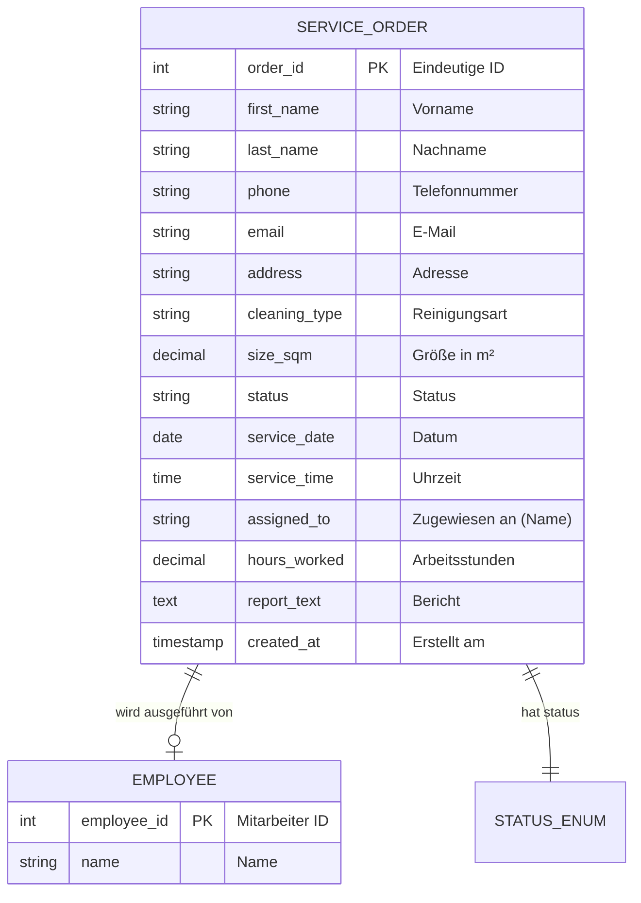

# Entity-Relationship-Modell (ERM)

Dieses Dokument beschreibt die Datenbankstruktur des Projekts **Service Auftrag**.

## Visuelles Diagramm (Mermaid)

## Datenwörterbuch

### 1. Tabelle: `ServiceOrder`
Dies ist die Haupttabelle der Anwendung, verantwortlich für die Speicherung aller Informationen zu Serviceaufträgen.

| Spalte | Typ | Beschreibung |
| :--- | :--- | :--- |
| **order_id** | `SERIAL` (PK) | Eindeutige Kennung des Auftrags (Auto-Inkrement). |
| **first_name** | `VARCHAR(100)` | Vorname des Kunden. |
| **last_name** | `VARCHAR(100)` | Nachname des Kunden. |
| **phone** | `VARCHAR(20)` | Telefonnummer für Kontakt. |
| **email** | `VARCHAR(100)` | E-mail-Adresse für Kontakt und Rechnung. |
| **address** | `TEXT` | Vollständige Adresse des Einsatzortes (Straße, Nr., PLZ, Ort). |
| **cleaning_type** | `VARCHAR(50)` | Art der Reinigung (z. B. 'Basic', 'Standard', 'Deep'). |
| **size_sqm** | `DECIMAL(10,2)` | Größe der Fläche in m². |
| **status** | `VARCHAR(20)` | Aktueller Status des Auftrags (Standard: 'New'). |
| **service_date** | `DATE` | Geplantes Datum für den Service (bei Disposition ausgefüllt). |
| **service_time** | `TIME` | Geplante Uhrzeit für den Service. |
| **assigned_to** | `VARCHAR(100)` | Name des zugewiesenen Mitarbeiters (Referenz). |
| **hours_worked** | `DECIMAL(5,2)` | Geleistete Arbeitsstunden (bei Abschluss ausgefüllt). |
| **report_text** | `TEXT` | Arbeitsbericht/Notizen des Mitarbeiters. |
| **created_at** | `TIMESTAMP` | Datum und Uhrzeit der Erstellung. |

### 2. Tabelle: `Employee`
Speichert die verfügbaren Mitarbeiter für die Zuweisung.

| Spalte | Typ | Beschreibung |
| :--- | :--- | :--- |
| **employee_id** | `SERIAL` (PK) | Eindeutige ID des Mitarbeiters. |
| **name** | `VARCHAR(100)` | Vollständiger Name (z.B. "Hans Müller"). |

### 3. Status-Ablauf
Das Feld `status` steuert den Lebenszyklus der Entität:
1.  **New**: Neu erstellt durch Kunde/Mitarbeiter.
2.  **Scheduled**: Mitarbeiter und Datum zugewiesen.
3.  **Completed**: Service ausgeführt (Stunden und Bericht erfasst).
4.  **Invoiced**: Prozess abgeschlossen und verrechnet.
5.  **Cancelled**: Auftrag storniert.

---
*Hinweis: Das Projekt verwendet ein denormalisiertes Modell, um die Implementierung zu vereinfachen. `assigned_to` speichert aktuell den Namen direkt, um historische Konsistenz zu wahren, auch wenn Mitarbeiter gelöscht werden.*
